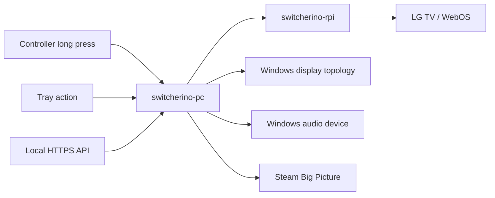

# switcherino-pc

Windows companion app for [`switcherino-rpi`](https://github.com/alecs297/switcherino-rpi).

`switcherino-pc` is the Windows side of a two-part living-room gaming setup:

- the PC knows how to switch its own display/audio state
- the Raspberry Pi knows how to control the TV
- both work together so a single action can move the whole setup from "desktop mode" to "gaming on TV mode"

This repository focuses on the PC bridge: a local HTTPS API, a tray app, controller shortcut detection, Windows profile switching, and Steam Big Picture orchestration.

## Why This Exists

The goal is simple: make a gaming PC feel more like a console when used from the couch, without losing a normal desktop setup the rest of the time.

Typical problem:

- during normal use, the PC may use one monitor setup and one audio device
- during TV gaming, the desired target is often a different display topology and a different audio device
- the TV may also need to switch to the right HDMI input
- Steam Big Picture should launch when entering the gaming state, then restore everything when it closes

`switcherino-pc` exists to automate the Windows part of that flow, while [`switcherino-rpi`](https://github.com/alecs297/switcherino-rpi) handles the TV side.

## The Full Setup

If you use the complete system, both repositories go together:

- [`switcherino-pc`](https://github.com/alecs297/switcherino-pc): Windows tray app + local API + controller/Steam/display/audio orchestration
- [`switcherino-rpi`](https://github.com/alecs297/switcherino-rpi): Raspberry Pi HTTPS bridge for LG WebOS TV control, source switching, and optional wake flow

High-level responsibilities:

| Component | Responsibility |
| --- | --- |
| `switcherino-pc` | Detect trigger, expose local API, switch Windows display/audio profile, launch/monitor Steam Big Picture, roll back on exit |
| `switcherino-rpi` | Control the TV over WebOS, switch HDMI source, optionally wake the TV with Wake-on-LAN, isolate TV networking through the Pi |

## End-To-End Flow

Typical gaming-mode flow:

1. you hold the configured controller shortcut for the configured duration, click the tray action, or call `POST /pc/action`
2. `switcherino-pc` asks `switcherino-rpi` to enter TV gaming mode
3. the PC applies the configured `gaming_profile`
4. the PC launches Steam Big Picture
5. while Steam is running, the gaming state stays active
6. when Big Picture exits, the PC restores the configured `default_profile`
7. the PC asks the Raspberry Pi bridge to return the TV side to default mode



## Features

- local HTTPS API with Bearer-token authentication
- tray icon for runtime status and quick actions
- manual gaming mode on/off from the tray
- local web server restart from the tray
- quick access to config and logs from the tray
- optional autostart at Windows login
- controller monitoring through `pygame`
- long press on a configurable controller button shortcut to trigger gaming mode
- default shortcut is `PS/Xbox + R1` using button indices `5` and `10`
- Windows display switching through the `DisplaySwitch.exe` topologies
- Windows audio device name and volume switching
- Steam Big Picture launch and automatic rollback when it closes
- persistent config, logs, and certificates under `%LOCALAPPDATA%`
- PyInstaller packaging for a background Windows executable
- Raspberry Pi bridge integration through [`switcherino-rpi`](https://github.com/alecs297/switcherino-rpi)

## Architecture

The app is intentionally small and split into focused modules:

| Area | Main files | Purpose |
| --- | --- | --- |
| App/bootstrap | `app.py`, `src/runtime.py`, `src/app.py` | Start the runtime, spawn the HTTPS server, wire FastAPI lifespan and background monitors |
| State/config | `src/config.py`, `src/models.py` | Persist settings, normalize config, define request models |
| Gaming orchestration | `src/gaming_mode.py` | Enter/exit game mode, coordinate Pi calls, display/audio changes, and Steam monitoring |
| Raspberry Pi bridge | `src/rpi_client.py` | Call `switcherino-rpi`, handle TLS trust and optional fingerprint pinning |
| Windows integration | `src/profile_actions.py`, `src/windows.py`, `src/autostart.py` | Switch display/audio, detect remote sessions, manage startup with Windows |
| Controller input | `src/controller.py` | Watch gamepads and detect a long button-shortcut hold |
| Steam detection | `src/steam.py` | Detect Big Picture windows and trigger rollback when they disappear |
| Tray UI | `src/tray.py` | Surface status and manual actions in the Windows tray |
| Setup/build scripts | `scripts/*.ps1`, `switcherino-pc.spec` | Initial setup, profile capture, debug helpers, and PyInstaller build |

Important architectural choices:

- the PC exposes its own HTTPS API so triggers can come from the controller, tray, or another local client
- the Pi and PC use a compatible action vocabulary (`switch_to_game_mode`, `switch_to_default_mode`) to keep orchestration simple
- Windows switching is intentionally conservative in V1: display topology, default audio device, and volume
- rollback is tied to Steam Big Picture visibility, not only to manual actions
- switching is blocked during Remote Desktop sessions to avoid unsafe display/audio changes

## Relationship With `switcherino-rpi`

The companion repo is not optional if you want automatic TV/source switching, but `switcherino-pc` is still usable on its own for local Windows automation.

What the Pi project adds:

- an HTTPS API on the Raspberry Pi
- LG WebOS integration
- source switching between the default TV source and the gaming source
- optional Wake-on-LAN for turning the TV on
- a Wi-Fi/hotspot model that keeps the TV off your main network and most importantly, off the internet

The PC app calls the Pi on:

- `GET /tv/status`
- `POST /tv/action`

The Pi app typically exposes:

- `switch_to_game_mode` to move the TV to the gaming input
- `switch_to_default_mode` to restore the default source
- `turn_on`, `turn_off`, and `change_source` for TV-only workflows

## Tray Menu

The packaged app is designed to run in the background with a tray icon that lets you:

- view the current runtime status
- enable or disable gaming mode manually
- restart the local web server
- enable or disable startup with Windows
- open the local API docs
- open the config file
- open the log file
- quit cleanly

## Persistence

The app stores its local state under:

```text
%LOCALAPPDATA%\SwitcherinoPc
```

Important persisted files and folders:

- config: `%LOCALAPPDATA%\SwitcherinoPc\config.json`
- certificates: `%LOCALAPPDATA%\SwitcherinoPc\certs`
- logs: `%LOCALAPPDATA%\SwitcherinoPc\logs\switcherino-pc.log`

This means config, generated certs, and logs survive restarts and upgrades.

## Quick Start

If you just want to run the project locally once:

```powershell
python -m venv venv
venv\Scripts\Activate.ps1
python -m pip install -r requirements.txt
scripts\initial-setup.ps1
python app.py
```

On first start, the app creates its config and self-signed certificate files automatically.

## Full installation

### 1. Create a virtual environment and install dependencies

```powershell
python -m venv venv
venv\Scripts\Activate.ps1
python -m pip install -r requirements.txt
```

Runtime dependencies:

- `fastapi` + `uvicorn` for the local HTTPS API
- `httpx` for Raspberry Pi calls
- `cryptography` for self-signed cert generation
- `pygame` for controller monitoring
- `pystray` + `Pillow` for the Windows tray app

### 2. Create the initial config

Run:

```powershell
scripts\initial-setup.ps1
```

This script:

- creates the config file if needed
- asks for the Raspberry Pi base URL
- asks for the Raspberry Pi API key
- can fetch `/certs` from the Raspberry Pi automatically
- stores the Pi certificate PEM locally when available
- can launch the interactive display/audio capture helper
- can open the config file at the end

### 3. Capture your Windows profiles

The display/audio helper can be run directly:

```powershell
scripts\display-helper.ps1
```

That helper:

- asks whether audio should be captured too
- captures a `default_profile`
- captures a `gaming_profile`
- stores the chosen display topology for each profile
- stores the current default render device name and volume when audio capture is enabled

Recommended capture flow:

1. run `scripts\display-helper.ps1`
2. put Windows in the desired everyday state
3. capture `default_profile`
4. put Windows in the desired TV gaming state
5. capture `gaming_profile`

### 4. Start the app

```powershell
python app.py
```

If `tray_enabled` is `true`, the tray icon becomes the primary UI. Otherwise the runtime simply keeps the local server alive.

## Local Development Setup

For day-to-day development, the normal workflow is:

```powershell
python -m venv venv
venv\Scripts\Activate.ps1
python -m pip install -r requirements.txt
scripts\initial-setup.ps1
python app.py
```

Useful local dev notes:

- config and logs are written to `%LOCALAPPDATA%`, not to the repo root
- the app creates its own self-signed certificate if missing
- the PC app can still run without a configured Raspberry Pi, but Pi-related steps will be skipped
- profile switching is meaningful only on a real local Windows session
- API docs are available locally at `/docs` and `/redoc`

## Build and Packaging

The recommended delivery format is a packaged Windows executable built with PyInstaller.

Build-specific dependency file:

```text
requirements-build.txt
```

Current build stack:

- `PyInstaller` packages the app
- [`switcherino-pc.spec`](./switcherino-pc.spec) defines the build
- `scripts\audio-helper.ps1` is bundled as packaged data
- `console=False` is used so the executable runs as a background app instead of opening a console window

Install build dependencies:

```powershell
python -m pip install -r requirements.txt -r requirements-build.txt
```

Build:

```powershell
scripts\build.ps1
```

What `scripts\build.ps1` does:

1. installs runtime and build dependencies
2. runs `PyInstaller --clean --noconfirm switcherino-pc.spec`
3. writes the packaged binary to `dist\switcherino-pc.exe`

Generated binary:

```text
dist\switcherino-pc.exe
```

## Configuration

The config file is stored in:

```text
%LOCALAPPDATA%\SwitcherinoPc\config.json
```

Example config:

```json
{
  "host": "0.0.0.0",
  "port": 8443,
  "api_key": "generated-secret",
  "cert_file": "C:\\Users\\Alice\\AppData\\Local\\SwitcherinoPc\\certs\\server.crt",
  "key_file": "C:\\Users\\Alice\\AppData\\Local\\SwitcherinoPc\\certs\\server.key",
  "suggested_base_url": "https://127.0.0.1:8443",
  "rpi_base_url": "https://192.168.1.20:8443",
  "rpi_api_key": "pi-secret",
  "rpi_verify_tls": true,
  "rpi_ca_file": "",
  "rpi_cert_fingerprint": "",
  "rpi_status_poll_interval_seconds": 30.0,
  "controller_backend": "pygame",
  "controller_poll_interval_seconds": 0.05,
  "controller_shortcut_hold_seconds": 3.0,
  "require_quiet_controller_hold": true,
  "analog_deadzone": 0.35,
  "controller_profiles": [
    {
      "name_contains": "Xbox",
      "shortcut_button_indices": [5, 10]
    },
    {
      "name_contains": "DualSense",
      "shortcut_button_indices": [5, 10]
    },
    {
      "name_contains": "Wireless Controller",
      "shortcut_button_indices": [5, 10]
    }
  ],
  "default_profile": {
    "display": {
      "topology": "internal_only"
    },
    "audio": {
      "enabled": true,
      "device_name": "Speakers",
      "volume_scalar": 0.6
    }
  },
  "gaming_profile": {
    "display": {
      "topology": "external_only"
    },
    "audio": {
      "enabled": true,
      "device_name": "LG TV",
      "volume_scalar": 1.0
    }
  },
  "launch_big_picture_command": "steam://open/bigpicture",
  "exit_big_picture_command": "steam://close/bigpicture",
  "steam_window_title_contains": "Big Picture",
  "steam_launch_grace_seconds": 10.0,
  "steam_poll_interval_seconds": 2.0,
  "steam_missing_polls_before_exit": 3,
  "autostart_enabled": false,
  "autostart_command": "",
  "tray_enabled": true,
  "open_logs_command": "",
  "open_config_command": "",
  "log_level": "INFO"
}
```

### Configuration Reference

| Key | Purpose |
| --- | --- |
| `host` | Bind address for the local FastAPI server |
| `port` | HTTPS port exposed by the local API |
| `api_key` | Bearer token used to authenticate local protected endpoints |
| `cert_file` | Local TLS certificate path used by the HTTPS server |
| `key_file` | Local TLS private key path used by the HTTPS server |
| `suggested_base_url` | Base URL advertised by `/certs` for local clients |
| `rpi_base_url` | Base URL of the Raspberry Pi bridge |
| `rpi_api_key` | Bearer token used when calling the Raspberry Pi |
| `rpi_verify_tls` | Whether the PC verifies the Pi TLS certificate |
| `rpi_ca_file` | Optional CA or server certificate file for trusting the Pi |
| `rpi_cert_fingerprint` | Optional SHA-256 fingerprint pin for the Pi certificate |
| `rpi_status_poll_interval_seconds` | Poll interval used for refreshing cached Raspberry Pi status |
| `controller_backend` | Controller backend selection. V1 currently supports `pygame` |
| `controller_poll_interval_seconds` | Sleep interval used by the controller monitor loop |
| `controller_shortcut_hold_seconds` | Duration the configured controller shortcut must stay pressed before triggering gaming mode |
| `require_quiet_controller_hold` | Whether other controller input cancels the hold trigger |
| `analog_deadzone` | Minimum analog axis movement considered meaningful controller activity |
| `controller_profiles` | Controller name matching and button-shortcut mapping used by the controller monitor |
| `default_profile.display.topology` | Display topology used when returning to the normal PC state |
| `default_profile.audio.enabled` | Whether the default profile restores audio |
| `default_profile.audio.device_name` | Friendly Windows render-device name matched when returning to the default profile |
| `default_profile.audio.volume_scalar` | Volume restored for the default profile, from `0.0` to `1.0` |
| `gaming_profile.display.topology` | Display topology used when entering the gaming state |
| `gaming_profile.audio.enabled` | Whether the gaming profile restores audio |
| `gaming_profile.audio.device_name` | Friendly Windows render-device name matched when entering the gaming profile |
| `gaming_profile.audio.volume_scalar` | Volume restored for the gaming profile, from `0.0` to `1.0` |
| `launch_big_picture_command` | Command or URI used to launch Steam Big Picture |
| `exit_big_picture_command` | Command or URI used to request Big Picture exit |
| `steam_window_title_contains` | Window title fragment used to detect whether Big Picture is still running |
| `steam_launch_grace_seconds` | Grace period after launching Big Picture before rollback detection is allowed |
| `steam_poll_interval_seconds` | Poll interval used to detect whether Big Picture is still visible |
| `steam_missing_polls_before_exit` | Number of consecutive failed Big Picture polls before rollback is triggered |
| `autostart_enabled` | Enables startup with Windows for the current user |
| `autostart_command` | Optional custom autostart command |
| `tray_enabled` | Enables the tray icon UI |
| `open_logs_command` | Optional custom command used by the tray to open the log location |
| `open_config_command` | Optional custom command used by the tray to open the config location |
| `log_level` | Logging verbosity passed to the runtime |

Each `controller_profiles` entry contains:

- `name_contains`
- `shortcut_button_indices`

Minimum useful setup:

- `default_profile.display.topology`
- `gaming_profile.display.topology`
- `rpi_base_url` and `rpi_api_key` if you want TV-side coordination

Setup notes:

- V1 display switching is topology-based and uses the same projection model as `Win+P`
- supported topologies are `internal_only`, `external_only`, `clone`, and `extend`
- audio capture stores the current default render device name and current volume
- audio switching matches active render devices by friendly name, so duplicate names can make switching ambiguous
- you can leave the Raspberry Pi fields blank during early local testing
- Steam launch defaults use native `steam://` URIs instead of `cmd /c start`

## Controller Behavior

The app currently monitors controllers through `pygame`.

Target behavior:

- Xbox controllers
- DualSense controllers
- generic PlayStation-style `Wireless Controller` naming
- holding the configured shortcut for the configured duration enters gaming mode
- the hold duration is configurable with `controller_shortcut_hold_seconds`
- by default the shortcut is `PS/Xbox + R1`, which maps to button indices `5` and `10`, pressed together with no other button presses allowed
- other controller activity during the hold cancels the trigger when `require_quiet_controller_hold` is enabled

Important controller notes:

- home-button indexing can vary depending on controller, driver, and SDL mapping on Windows
- the default config currently uses `PS/Xbox + R1` for Xbox and PlayStation-family controllers on this setup, mapped to button indices `5` and `10`
- you should validate the configured shortcut indices on your own hardware
- a debugging script exists for identifying your controller's indexes

## API

Swagger documentation is exposed locally through FastAPI at:

- `/docs`
- `/redoc`

Main local API routes:

- `GET /certs`
- `GET /pc/status`
- `POST /pc/action`

Protected endpoints use:

```text
Authorization: Bearer YOUR_API_KEY
```

### `GET /pc/status`

Returns the current bridge status, including:

- whether gaming mode is active
- which local profile is currently active
- whether Windows currently reports a Remote Desktop session
- whether the Raspberry Pi is configured
- the Raspberry Pi host
- whether Steam Big Picture is currently detected
- controller monitor state
- the configured `default` and `gaming` profiles
- whether the initial setup looks complete

### `POST /pc/action`

Supported actions:

- `switch_to_game_mode`
- `switch_to_default_mode`

For schema compatibility, the request model also accepts:

- `turn_on`
- `turn_off`
- `change_source`

Those actions are intentionally rejected with `400` on the PC bridge.

Example request:

```powershell
curl.exe -k `
  -H "Authorization: Bearer YOUR_API_KEY" `
  -H "Content-Type: application/json" `
  -d "{\"action\":\"switch_to_game_mode\"}" `
  https://127.0.0.1:8443/pc/action
```

If Windows reports that the current session is running over Remote Desktop, `switch_to_game_mode` and `switch_to_default_mode` are rejected with `409 Conflict`.

## Runtime Behavior

Entering gaming mode currently does the following:

1. call the Raspberry Pi with `switch_to_game_mode`
2. apply `gaming_profile.display.topology`
3. launch Steam Big Picture
4. optionally restore `gaming_profile.audio.device_name` and `gaming_profile.audio.volume_scalar`

Leaving gaming mode currently does the following:

1. request Big Picture exit, unless it is already gone
2. call the Raspberry Pi with `switch_to_default_mode`
3. apply `default_profile.display.topology`
4. optionally restore `default_profile.audio.device_name` and `default_profile.audio.volume_scalar`

Automatic rollback:

- when Big Picture is no longer detected for several consecutive polls, the app leaves gaming mode automatically

## Certificates

The app generates a self-signed certificate automatically for the local HTTPS server.

Generated files are stored in:

```text
%LOCALAPPDATA%\SwitcherinoPc\certs
```

Clients can retrieve certificate pinning material from:

- `GET /certs`

For the Raspberry Pi bridge, the PC can also:

- trust a configured CA/server PEM via `rpi_ca_file`
- optionally pin the Pi certificate with `rpi_cert_fingerprint`

## Startup With Windows

Autostart is implemented through the registry key:

```text
HKCU\Software\Microsoft\Windows\CurrentVersion\Run
```

This means:

- no administrator rights are required
- startup is per-user
- it starts after login, not before

## Logging

Logs are written to:

```text
%LOCALAPPDATA%\SwitcherinoPc\logs\switcherino-pc.log
```

If startup fails, the app also shows a Windows message box pointing to the config and log paths.

## Debug Scripts

Useful scripts in [`scripts/`](./scripts):

- `scripts\debug-controller.py`: prints detected controllers, button events, axis and hat movement, and reports a long press after the configured hold duration. Useful for validating the real home-button index on the current machine.
- `scripts\inspect-steam.py`: watches visible Windows titles to help debug Steam / Big Picture detection and rollback behavior.
- `scripts\display-helper.ps1`: captures the current default and gaming display/audio profiles.
- `scripts\initial-setup.ps1`: bootstraps the first local config and Raspberry Pi certificate trust.

Controller debug example:

```powershell
python scripts\debug-controller.py
```

Useful options:

- `--hold-seconds 3` to change the long-press threshold during tests
- `--deadzone 0.35` to adjust how much analog movement is logged
- `--poll-sleep 0.02` to change the polling cadence

## `switcherino-rpi` Local Installation

If you want the full PC + TV setup locally, the companion repository needs to be installed on a Raspberry Pi.

See the Pi repository for the complete instructions:

- [`switcherino-rpi` on GitHub](https://github.com/alecs297/switcherino-rpi)

## Current Limitations

- display switching is intentionally limited to the four Windows projection-style topologies for V1
- V1 does not restore a full monitor layout with resolution, refresh rate, HDR, scaling, or exact screen identity
- controller home-button mapping still needs real-hardware validation depending on the controller and driver stack
- Steam detection is window-title based, which is pragmatic but not as strong as a dedicated integration
- TV-side automation depends on the Raspberry Pi bridge being configured and reachable
